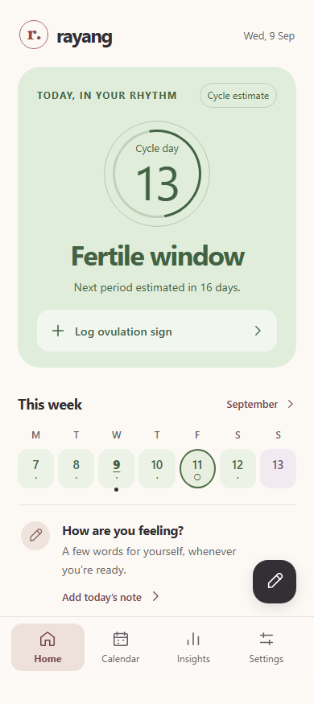
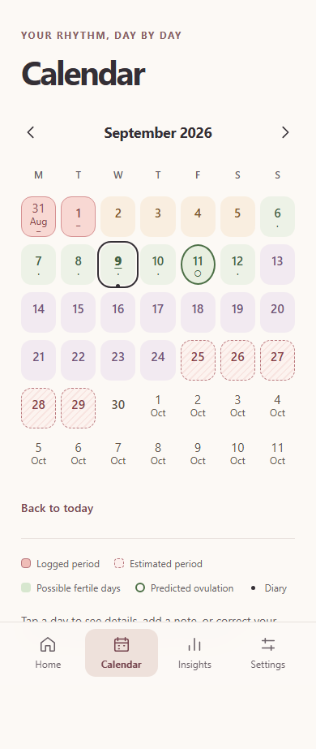

# Rayang

**Your cycle, your own rhythm.** A small, private menstrual-cycle tracker and daily diary, made for one person. No account, ads, subscriptions or social features. Optional **Partner View** shares only explicitly selected cycle timing, encrypted before upload. Sharing starts **off**.

Rayang is an independent personal project and is not affiliated with Flo or any other menstrual tracking service. Its interface, monogram and wording are original.

## A quiet daily experience

- A phase-focused home: cycle day, next estimated period, a seven-day strip and one relevant logging action.
- Short onboarding that explicitly asks about the latest period, its end, usual duration and cycle length.
- A month calendar with distinct actual/estimated bleeding, possible fertile days, an ovulation ring, today and diary markers.
- Editable period ranges, separate bleeding days, observed ovulation signs and lightweight notes with optional mood, symptom and flow tags.
- Simple personal statistics, complete active-history JSON export/import, a pre-import recovery copy, and confirmed deletion.
- Installable, offline-capable PWA with safe-area spacing and an update prompt that waits while a form is open.

## Screenshots

These are synthetic test fixtures, not anyone’s personal information. Browser tests regenerate them.

 

## Privacy and data ownership

All source cycle events, diary content and preferences live in **IndexedDB on the current browser/device**, through Dexie. Predictions are calculated locally. With Partner Sharing off, there are no sharing API calls or health-data uploads. There are no external fonts, analytics, tracking pixels, remote error logs or accounts. The service worker caches only app assets.

After explicit consent, a small allowlisted snapshot of the selected categories is encrypted with AES-256-GCM and synchronized to the site's capability-protected API. Diary, symptoms, moods, private notes, ovulation observations, backups and full settings never enter this payload. The backend has ciphertext and hashed capabilities, never the encryption key. The partner has read-only access. See [the security design](docs/PARTNER-SECURITY.md) and [engineering report](docs/PARTNER-REPORT.md).

Your hosting provider still receives normal requests for the static application and may retain standard access logs (for example, IP address and asset paths). Health data is not included in those requests. Do not enable Netlify Analytics, injected scripts, or external tracking integrations.

Primary history and ordinary JSON backups are **not encrypted by Rayang**. The partner cache is encrypted, but its key is in the same browser's IndexedDB; it is not a hardware keychain. Use your device lock and keep exports private. Browser/private browsing restrictions, device loss, storage eviction, clearing site data and changing origins can all make local history unavailable. An installed PWA is not a substitute for backups.

### Export, import and delete

1. **Settings → Export data** downloads a versioned JSON file containing the complete active profile, periods, diary, ovulation observations and separately logged bleeding days.
2. **Settings → Import data**, or **Restore from a backup** during onboarding, validates the file and shows a record count before you confirm replacement.
3. A single **pre-import recovery copy** is saved in the same database transaction before replacement. Export it with **Export pre-import recovery copy**. Each successful import replaces the previous recovery copy. Recovery is kept separately from the active-data export to avoid recursive backups.
4. Failed validation or a failed database transaction leaves existing data and recovery intact.
5. **Delete all data** requires typing `DELETE` and pressing the destructive confirmation. It removes the active database contents and recovery copy, but cannot remove downloaded files.

Keep the same production URL after installation. Localhost, a deploy preview, a custom domain and the final Netlify domain have separate databases. Export and import to move between them.

Stop Partner Sharing before importing or deleting primary history. A pending offline stop must finish first. Sharing credentials and the partner cache are stored separately and never enter ordinary backups. Revocation stops future authorized synchronization after the server confirms it; it cannot erase screenshots, copies, or an offline cache on another device.

## Partner View

Primary: **Settings → Partner sharing → Enable → select categories → Confirm → QR or private pairing link**. All three categories start unchecked. Invitations expire in ten minutes and have one successful claimant. A retry by that same claimant is safe; another device needs a new invitation after the primary stops the old relationship. To change categories, stop and pair again with new keys.

Partner on iPhone: open the invitation in Safari. The **Partner Setup** page keeps it unclaimed. Add the root Rayang app to Home Screen if needed, press **Copy setup code**, then open Rayang from Home Screen. Choose **I have a partner setup code**, paste it, review the categories and press **Accept Partner View**. This creates the pairing in the installed app's own storage; it does **not** depend on Safari and the PWA sharing IndexedDB. Existing installations can use **Settings → Set up Partner View on this device**. If an invitation opens directly inside standalone Rayang, copy/paste is unnecessary.

Home, Calendar and Settings remain read-only. The date and time identify the last shared snapshot; old data is marked stale and never recalculated as fresh. Foreground/manual refresh fetches updates. A connection unavailable at the API clears the cached snapshot and credentials; temporary network failures retain the last valid cache. **Disconnect this device** clears them locally.

Setup codes carry the existing high-entropy invitation capability and client-only decryption key, never health records or a writer capability. They expire with the ten-minute invitation. Keep them private: clipboard access or a leaked code can allow someone to claim the pending invitation. Copying happens only when requested; Rayang does not read or automatically clear the clipboard. Remove saved copies and replace clipboard contents after setup. The installed app generates its own reader capability. Another clean device cannot reuse an already claimed setup code, although existing reader credentials can still be cloned by someone with device access. Revocation continues to apply.

Sync occurs on meaningful cycle changes, opening/resuming the primary app and **Sync now**. Diary-only edits do not upload. There is no polling or background push. Active shares expire after 30 days without publication. Keep invitations private: someone who obtains one before acceptance can claim it. Timing can be inferred from other timing categories even when fertility estimates are withheld.

## Predictions and limitations

Rayang is a tracker, **not contraception, a fertility/pregnancy test, a diagnostic tool, or a substitute for professional medical advice**. Dates outside the possible fertile window are not guaranteed pregnancy-safe. Ovulation signs remain user observations; they do not confirm ovulation or shift the prediction.

The pure engine uses up to six recent completed cycle lengths. With one or two cycles it blends history with one starting-prior observation. With three or more it combines 60% median with 40% recency-weighted mean after bounding extreme values for the estimate only. Original lengths remain unchanged. Known period durations use the recent median, including both first and last bleeding days.

Next period = latest actual start + estimated cycle length. Estimated ovulation = next estimated period − 14 days. The possible fertile window spans five days before through one day after that date. These are configurable modeling assumptions, not individualized biological measurements. For biological context see [ACOG’s fertility-awareness explanation](https://www.acog.org/womens-health/faqs/fertility-awareness-based-methods-of-family-planning).

The exact formulas, range interpretation, display priority, overdue behavior and date conventions are in [docs/PREDICTIONS.md](docs/PREDICTIONS.md).

## Local development

Requires Node.js **22.12 or newer** and npm. No secrets or environment variables are required.

```bash
npm install
npm run dev
```

Open the URL printed by Vite (normally `http://127.0.0.1:5173`). A fresh browser starts with onboarding and an empty database.

For a complete local pairing journey, use **`npm run dev:partner`** and open `http://127.0.0.1:8888` in two isolated browser profiles. This builds the production PWA and serves the actual API logic with an **ephemeral in-memory test store**. Restarting it loses remote shares; never deploy this helper. Plain Vite/preview has no sharing API. For platform integration, use Netlify CLI `netlify dev` with the site linked; verify platform storage and headers on an HTTPS staging deployment before release. See [deployment details](docs/PARTNER-DEPLOYMENT.md).

```bash
npm run typecheck
npm run lint
npm run test
npm run test:timezones
npm run build
npm run preview
```

For repeatable installs after cloning, use `npm ci`. `npm run check` runs TypeScript, lint, unit/interaction tests and a production build. `npm run format` formats source; `npm run format:check` verifies it.

On this Windows workstation, `npm.cmd` works while the PowerShell `npm.ps1` wrapper refers to a missing global npm installation. Use `npm.cmd` in place of `npm` here (for example, `npm.cmd run dev`). No global machine settings were changed.

### Browser tests

```bash
npx playwright install chromium webkit
npm run build
npm run test:e2e
```

Playwright starts the local production PWA/API test server on port 4173. Tests cover the original journeys and two-profile pairing, cycle publication, private-field exclusion, read-only calendar, cached network-failure behavior and revocation. These use isolated synthetic databases. See [docs/QA.md](docs/QA.md) for scope and physical-iPhone checks.

### Demo fixtures

Only the development server supports `?demo=period`, `?demo=follicular`, `?demo=fertile`, `?demo=ovulation`, `?demo=luteal`, `?demo=irregular` and `?demo=new`.

For example, `http://127.0.0.1:5173/?demo=fertile` shows an explicitly labeled temporary fixture. Edits remain in memory and are lost on reload. Demo mode does not read or write real health records and never synchronizes. Partner fixtures use `?partner-demo=period`, `follicular`, `fertile`, `ovulation`, `luteal`, `limited`, `stale`, `offline`, `none` or `revoked`. Fixture code and both demo handlers are excluded from the production build.

## Deploy to Netlify

1. Push this project to your GitHub repository.
2. In Netlify, choose **Add new project → Import an existing project**, then connect that repository.
3. Netlify reads `netlify.toml`: build command **`npm run build`**, publish directory **`dist`**, Node **22**, Functions in **`netlify/functions`**. Partner Sharing uses site-scoped Netlify Blobs. No custom environment variables or application master key are required; the platform injects its storage authorization server-side.
4. Deploy over HTTPS. Do not add data collection integrations or injected scripts. A restrictive Content Security Policy, no-referrer policy and anti-framing headers are included.
5. Complete the [staging API/storage checklist](docs/PARTNER-DEPLOYMENT.md), then test onboarding, offline use, backup/restore and two-device sharing on the intended final origin with synthetic data.

Navigation uses URL hashes so all four screens are reachable offline. A static SPA fallback is also configured. Hashed assets may be cached immutably; `sw.js` and `index.html` are revalidated. Deployment configuration is ready; connecting GitHub and publishing to your chosen Netlify account are manual steps.

## Install on iPhone

Open the final HTTPS URL in Safari → **Share → Add to Home Screen**. Launch once online and wait for the offline-ready notice. Then test in Airplane Mode. The manifest uses standalone display, full app icons and a maskable icon; Apple metadata and a touch icon are included.

For Partner View, follow the setup-code handoff above rather than accepting in Safari and expecting its storage to transfer. The stable manifest ID, scope and start URL remain `/`. The exact two-context physical-iPhone checklist is in [PARTNER-DEPLOYMENT.md](docs/PARTNER-DEPLOYMENT.md); browser automation does not certify physical iOS behavior. See [the v0.2.1 handoff report](docs/PARTNER-HANDOFF-REPORT.md).

Updates are offered after a new worker is ready, with **Update now / Later**. Open sheets suppress the notice, so your own update action does not interrupt a form. Test a real update on the installed iPhone before regular use. iOS installation, storage behavior, keyboard geometry and status-bar appearance need physical-device confirmation.

## Structure

```text
src/
  App.tsx                  navigation and local-data orchestration
  components/              sheets, icons, service-worker update notice
  db/                      versioned IndexedDB, atomic changes and backups
  features/                onboarding, home, calendar, logs, insights, settings
  hooks/                   local date rollover and resume handling
  lib/                     date-only utilities, prediction, validation, records
  partner/                 strict snapshot, crypto, separate storage, sync and read-only UI
  test/                    setup and development-only fixtures
  types.ts                 actual data schemas (no stored predictions)
e2e/                       production browser journeys and offline test server
public/                    original SVG and PNG app icons
docs/                      algorithm, QA, screenshots
scripts/                   icon regeneration and multi-timezone tests
server/                    capability API, strong conditional Blobs adapter and test store
netlify/functions/         API endpoint and scheduled expiry cleanup
```

Browser dependencies: React, React DOM, date-fns, Dexie and lazy QR generation with qrcode. Server dependencies: @netlify/functions and @netlify/blobs. Build/testing also uses tsx for the local API helper. CSS uses design tokens and system fonts; no UI framework, charting library or global state framework.

## License and future work

MIT is recommended for a small educational/personal open-source application; an [MIT license](LICENSE) is included. Confirm the license choice before publishing.

Potential future refinements include an independent protocol audit, a carefully designed encrypted export option, and optional device-bound credentials. These are not implemented. Accounts, full-database cloud backup and medical modes remain absent.
